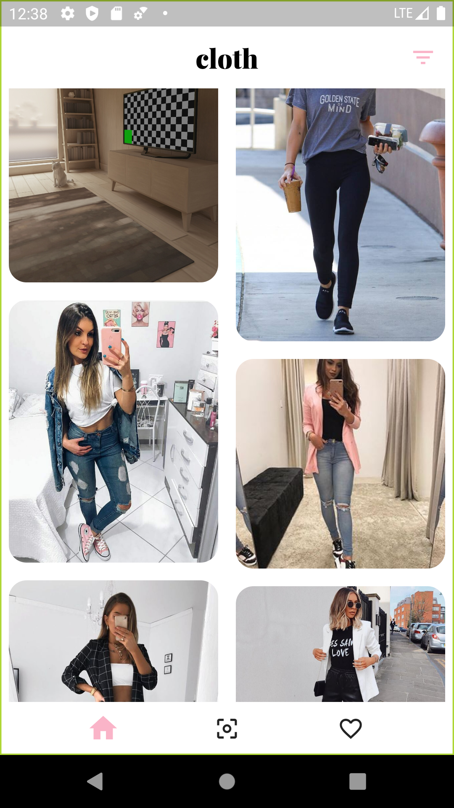
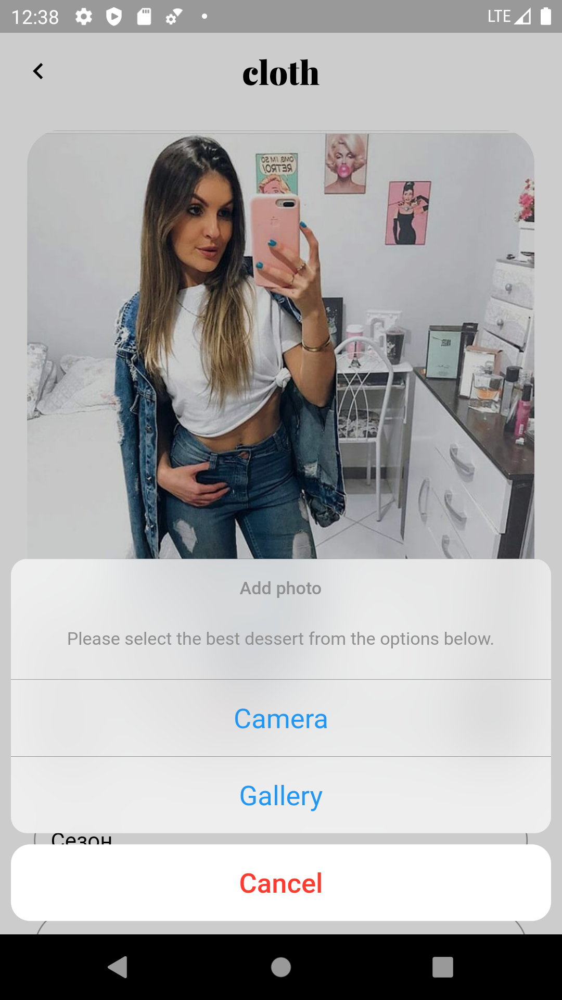
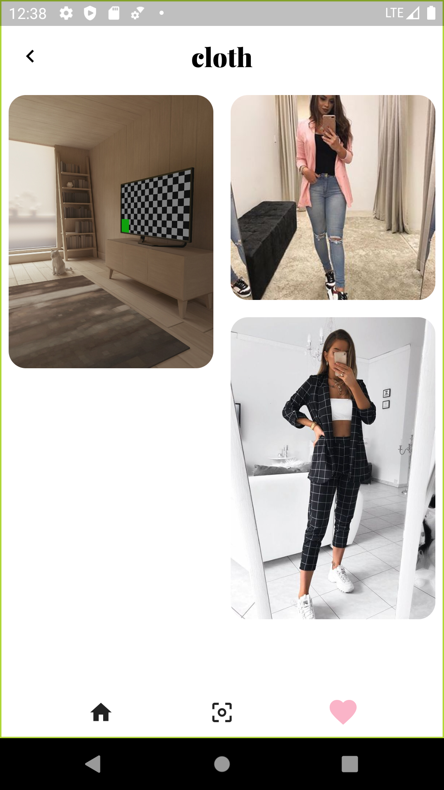
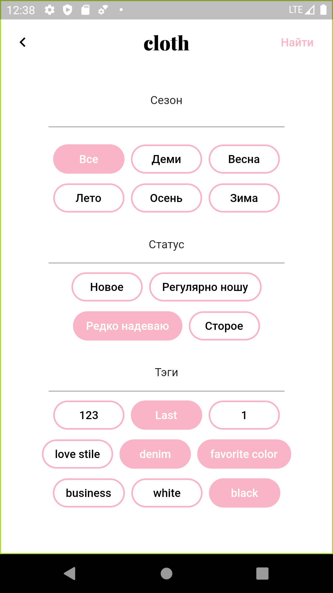
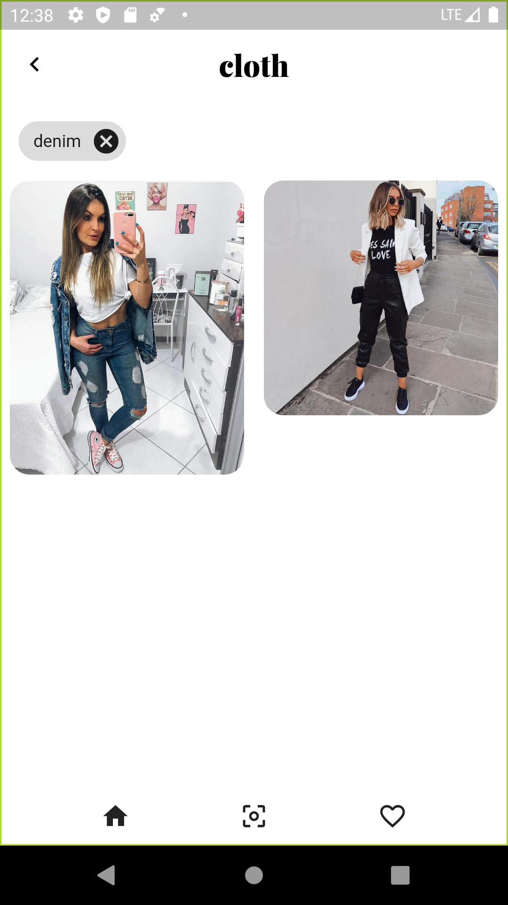

# cloth

A Flutter project gallery-like for those who want to save garb in one place.

## Getting Started 

- Clone the repo
- Install the dependicies
- Run it

## Todos

- [ ] Login (with Google, Facebook or email)
- [x] Main page
- [x] Filter search
- [x] Add/Edit page
- [x] Favorite page
- [ ] Settings (Colors, fonts, photo view organize)
- [ ] Profile page

## ScreenShots
|                                       |                                       |
| ------------------------------------- | ------------------------------------- |
|  |  |
|  |  |
|  |
